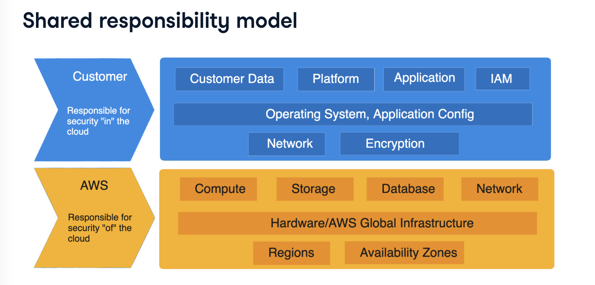
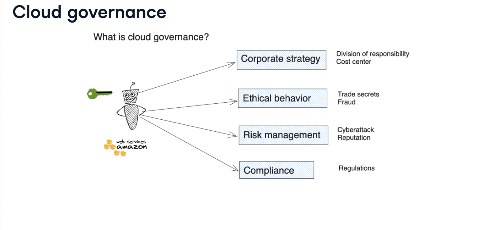
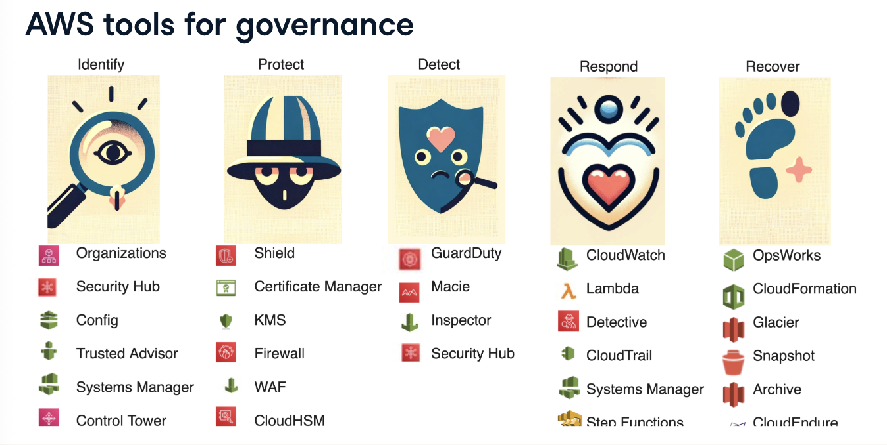
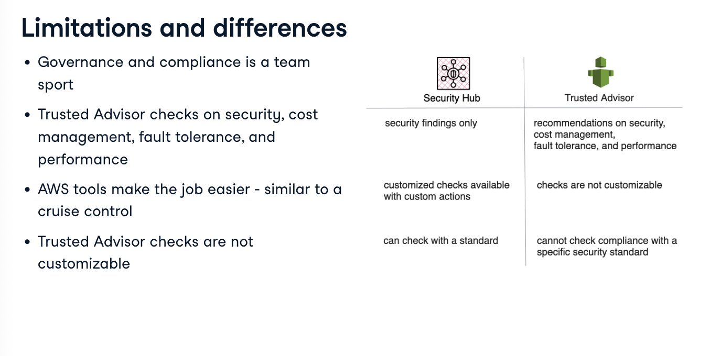
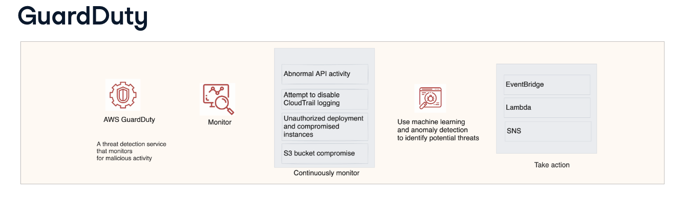

# Introduction to AWS Security and Compliance

## AWS Security and Cost Management

**Question: why is cloud security important??**
- sensitive data
- reputation risk
- compliance requirement
- financial consequences

**Security in the cloud - Customer responsibilities**
- credentials
- database access
- application software installed on server
- encryption keys

**Security in the cloud - AWS responsibilities
- access to building and equipment
- network connectivity
- power backup
- infrastructure software e.g., routing

> tasks related to hardware usually lies with the cloud provider, whereas software updates lies with the customer.

## AWS Compliance and Governance

**Question: what is cloud governance??**
- it is a set of policies and rules used by companies who work in the cloud.
    - this framework is designed to ensure corporate strategy, ethical behaviour, risk management, and compliance.

- sound governance practices help minimise internal risks such as ethical behaviour and external risks such as cyber attacks, and regulatory compliance.

**Governance functions**
1. indentify critical resources and governance model
2. detect anomalies and malicious activities
3. protect data and assets
4. respond thorough incident response planning
5. recover to prior condition (for data loss/attack)

Examples:

1. Threat identification

- for threat identification, Security Hub automatically and continuously checks the AWS resources for security best practices. 
- helps find misconfiguration and gathers security alerts

2. Tools for protection

- AWS Shield helps protect computer network from large coordinated attacks known as DDoS.
- Access Management (IAM) helps protect login attempts with multi-factor authentification.

3. Detection tools

- CloudWatch helps detect anomalies and malicious activities.
- AWS Inspector is an automated vulnerability management service that continually scans AWS workloads for software vulnerabilities.
- AWS GuardDuty is a threat detection service that monitors for malicious activity. it's a malware protection service in the cloud.

4. Response and recovery

- CloudTrail enables auditing, security monitoring, and operational troubleshooting by tracking user activity and API usage.
- Glacier is an archival storage solution built on S3. it is optimised for large volume, infrequent and slower retrieval time.

## Security And Compliance Automation

1. AWS Security Hub - provides a quick overview into the security posture management, including specific non-compliant items.
    - checks for security practices across multiple accounts. it aggregates alerts across 60+ AWS security services and partner integrations including AWS Inspectory and GuardDuty
    - supports remediation by invoking a Lambda function

> checking compliance with a specific standard is as easy as enabling that specific standard in the Security Hub

2. AWS Trusted Advisor - helps observe best practices with an eye toward saving moneny, improving system performance and reliability, and closing security gaps.
    - helps monitor multiple aspects of governance controls such as cost optimization, availability, and business continuity.
    - 

3. GuardDuty - detects threats by monitoring AWS accounts and workloads for malicious activity.
    - scans EC2 instances and S3 buckets for malware, analyzing logs for threat detection without requiring additional infrastructure.
    - generates detailed findings to help us see and fix potential issues.
    - workes independently, without affecting resources' performance or availability.

