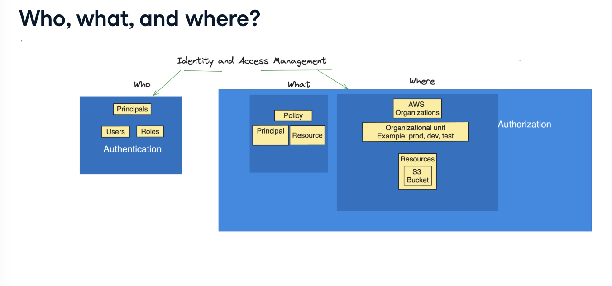
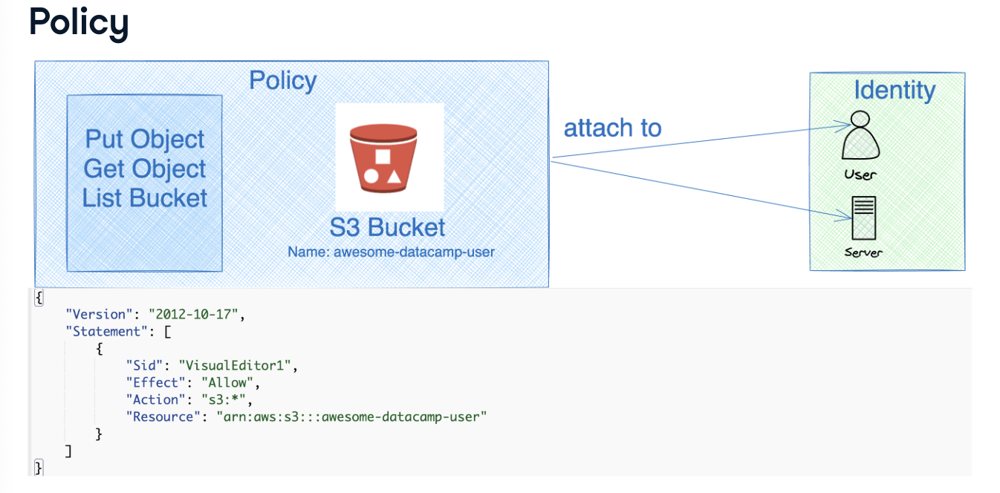
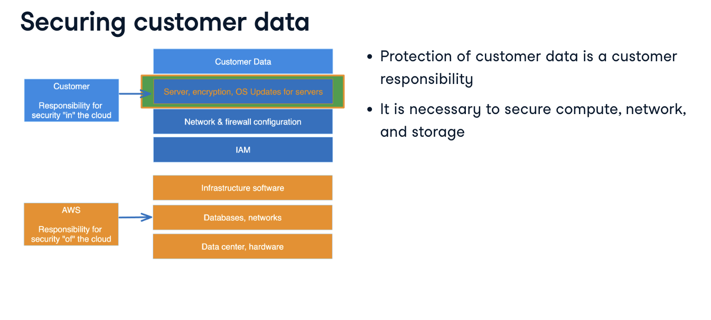
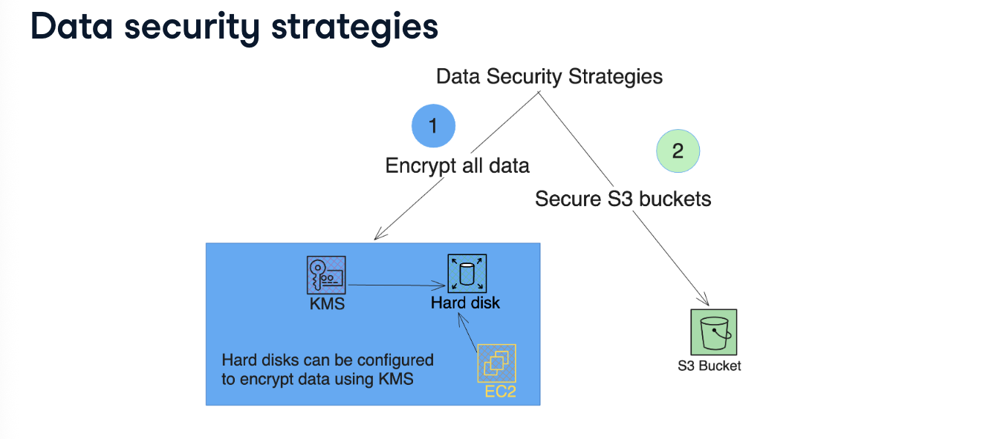

# Network and User Security

## The Principle of Least Priviledge

**Question: what is the principle of least priviledge??**
- the principle is about granting users and systems the narrowest set of priviledges to complete required tasks.

> Note: don't grant more priviledges than necessary to perform job responsibilities.

- implementing the principle of least priviledge in real life is a balancing act.

**Strategies for least priviledge**

- there are five steps to implementing least priviledge which include:

1. use course-grained security to grant the most common security controls at the highest level e.g., blocking public access to networks and storage at the Organization level.

2. use fine-grained controls to solve specific access questions e.g., limiting which group of users that can login to production servers.

3. use accounts as boundaries to provide structure for security administration.

4. prioritise short-term credentials. AWS Security Token Service enables us to request temporary, limited-priviledge credentials for users.

5. enforce broad invariants. invariants are items that don't vary or change e.g., a company in Belgium with its entire business operations in Europe will not need to use servers in Latin America.

**Account security framework**

- root user security is critical
- grant least necessary priviledges to users, groups, and computing resources
- develop a process for credential sharing

- always secure AWS root account with a strong password and multi-factor authentication. avoid creating access keys for the root user.
    - use a group email and multi-personal approval for added protection

**Resource security**

- helps:
    - improve visibility and control
    - maintain instance compliance against patch, configuration, and custom policies
    - automate configuration and ongoing management of the applications.

- computing resources such as VMs execute code and need to be secured. VM permissions can be managed using IAM roles while Systems Manager can help with confguration, patch management and automation of operational tasks.

**Credential security**

- AWS Secrets Manager securely manages database credentials and API keys. it automatically rotates secrets to keep them safe.
- can also encrypt sensitive data
- it integrates seamlessly with other AWS services for added convenience and security.

## Identity and Access Management (IAM)

**Question: why does IAM matter??**
- IAM helps grant permissions and makes access and authorization management simpler.

- permissions granted to machines are called roles
- principal is the term used to describe both users and roles.
    - the authorisation part of IAM make up the "what" and the "where".

- policies are text documents and they specify authorized principals and resoures.
    - AWS Organizations make up the "where" part of IAM.
    - NB: in the "where" part, organizational units like "production", "development", or "test" can be defined.

**Users vs. Roles**
- users have long-term credentials while roles use short-term credentials.
- NB roles cannot be grouped
- roles are often assigned to servers which retrieve credentials dynamically from AWS STS.

**Policy**
- an IAM policy specifies which actions can be performed on a resource.

- here we can see that the policy allows all actions to be performed on a single bucket called "awesome-datacamp-user".
- once a policy is attached to an identity, which can be a user or role, that identity can perform actions specified on the resource.

IAM Identity Center can create or connect workforce users and centrally manage their access to all of their AWS accounts and applications.
- we can either create new user accounts or connect existing work accounts such as Office 365, Google Apps using single sign-on.
- access can be granted to multiple AWS accounts which are part of the same organization or external to the organization.

## Network Security in AWS

**Question: what is a subnet??**
- smaller, isolated network inside a larger one.

- a subnet contains multiple devices.
- a network consists of multiple subnets.
- a router is used to route traffic between subnets and networks
- a route table maintains mapping of network addresses that the network links.

**Virtual private cloud**
- made up of virtual network and other components such as firewall and DNS.

**VPC security**
- five steps in securing networks in AWS:
    - subnet design
    - isolate environments
    - use Network Access Control Lists (NACL)
    - firewall and WAF
    - monitor flow logs

**NACL, firewall, and WAF**

| Feature    | AWS Firewall   | NACL     | AWS WAF    |
|  ---       |  ---           | ---      |  ---       |
| Scope      | Regional or VPC-level    | Subnet-level  | Application-level |
| Statefulness      | Stateful       | Stateless | Stateful  |  
| Default Rules     | Managed rules available   | Deny unless allowed   | Allow, block, or count based on rules |
| Cost  | Charged per usage     | No additional cost    | Charged per request & rules   |
| Best for        | High-level security control     | Broad network control         | Protecting web applications       |  

## Compute and data security

**Compute security strategies**
- to keep the EC2 servers secure, it is important to keep the credentials secure e.g., use of SSH keys instead of passwords.
    - also:
        - updating OS with latest patches
        - control access to servers using security groups
        - use IAM roles instead of stored credentials
        - use security groups

**Security groups**
- acts as virtual firewall for EC2 instances to control incoming and outgoing traffic.
- they allow fine-grained traffic to an from and individual server.
- NACL rules apply to the entire subnet.
- security groups are stateful i.e., they remember connection status. also allow outbound traffic by default

**Data security strategies**
- there are two strategies to secure data at-rest, which is data on hard disks.
    1. encryption 
    2. securing S3 buckets

**Encryption at-rest**
- means that the data is locked up and protected when it is stored on a computer or a server.
- works automatically with storage services like S3 and EBS
- NOTE: customers can manage encryption keys using AWS Key Management Service (KMS) or bring their own keys and help meet compliance.