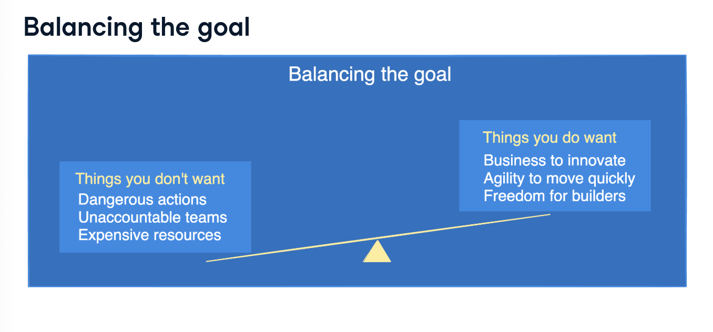
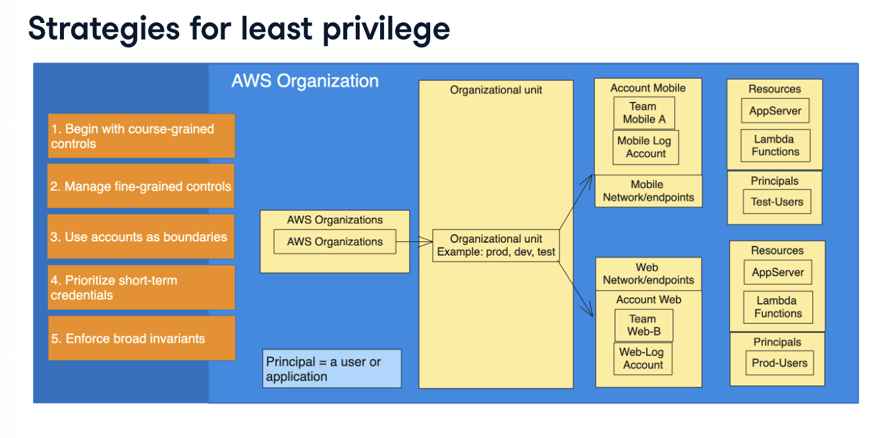

# Network and User Security

## The Principle of Least Priviledge

**Question: what is the principle of least priviledge??**
- the principle is about granting users and systems the narrowest set of priviledges to complete required tasks.

> Note: don't grant more priviledges than necessary to perform job responsibilities.

- implementing the principle of least priviledge in real life is a balancing act.

**Strategies for least priviledge

- there are five steps to implementing least priviledge which include:

1. use course-grained security to grant the most common security controls at the highest level e.g., blocking public access to networks and storage at the Organization level.

2. use fine-grained controls to solve specific access questions e.g., limiting which group of users that can login to production servers.

3. use accounts as boundaries to provide structure for security administration.

4. prioritise short-term credentials. AWS Security Token Service enables us to request temporary, limited-priviledge credentials for users.

5. enforce broad invariants. invariants are items that don't vary or change e.g., a company in Belgium with its entire business operations in Europe will not need to use servers in Latin America.

**Account security framework**

- root user security is critical
- grant least necessary priviledges to users, groups, and computing resources
- develop a process for credential sharing

- always secure AWS root account with a strong password and multi-factor authentication. avoid creating access keys for the root user.
    - use a group email and multi-personal approval for added protection

**Resource security

- helps:
    - improve visibility and control
    - maintain instance compliance against patch, configuration, and custom policies
    - automate configuration and ongoing management of the applications.

- computing resources such as VMs execute code and need to be secured. VM permissions can be managed using IAM roles while Systems Manager can help with confguration, patch management and automation of operational tasks.

**Credential security

- AWS Secrets Manager securely manages database credentials and API keys. it automatically rotates secrets to keep them safe.
- can also encrypt sensitive data
- it integrates seamlessly with other AWS services for added convenience and security.